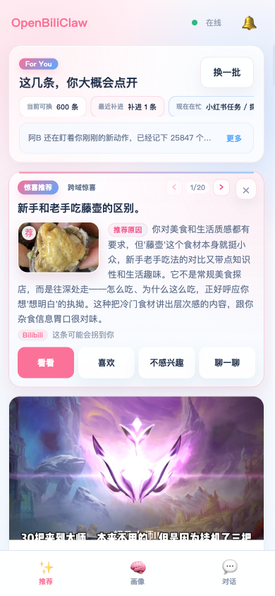
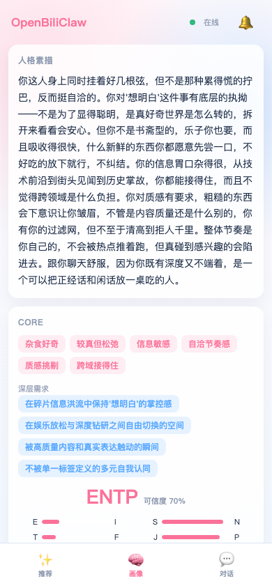
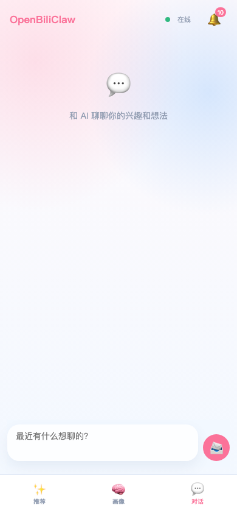

<div align="center">

# 🦀 OpenBiliClaw

**通用个性化内容推荐 Agent——本地运行、跨平台理解你、只为你一个人构建**

*A general-purpose personalized content discovery Agent — runs on your machine, understands only you*

[](https://opensource.org/licenses/MIT)
[](https://www.python.org/downloads/)
[](https://linux.do/)
[](https://linux.do/t/topic/1978894)

[项目主页](https://whiteguo233.github.io/OpenBiliClaw/) | [English](README_EN.md) | 中文

</div>

> 名字起源于 B 站（`Bili` = Bilibili，`Claw` = 爪子），项目最早只支持 B 站。从 v0.3.0 起已扩展为通用跨平台 Agent —— 已落地 B 站 / 小红书 / 抖音 / YouTube 初始化信号、抖音 search / hot / feed 内容发现和通用 Web 多类源，持续接入更多内容平台。

---

## 📌 v0.3.88 / extension v0.3.42 重要更新（2026-05-21）

- **📱 移动端 Web 成为主入口之一** —— 同局域网手机访问 `/m/` 可看推荐、画像、聊一聊、消息和惊喜推荐；插件顶部手机图标可直接弹出扫码入口。
- **📶 二维码自动改用局域网 IP** —— 插件后端仍是 `127.0.0.1` / `localhost` 时，会读取 `/api/health.lan_ip`，优先显示 `192.168.x.x` / `10.x.x.x` / `172.16-31.x.x` 这类手机可访问地址。
- **🖼️ 封面图改走本地代理** —— 移动端 Web 和插件 side panel 的推荐、惊喜推荐、消息封面统一经 `/api/image-proxy` 加载，后端做 CDN 白名单、redirect 和 10MB 大小校验，失败时保留占位区域。
- **✨ 手机惊喜推荐样式刷新** —— 移动端推荐页现在用真实 compact banner 展示惊喜推荐，推荐原因围绕左侧头图排版，动作与插件保持一致。
- **🚫 LLM fallback 默认关闭** —— `[llm].fallback_enabled` 默认 `false`，请求失败直接暴露而非静默切 provider。
- **🚫 Embedding fallback 默认关闭** —— `[llm.embedding].fallback_enabled` 默认 `false`，不再借用 chat-side 凭据或切换 embedding provider。
- **🔌 Embedding 完全独立** —— embedding provider 留空即禁用，不再跟随 `[llm].default_provider`；两套配置彻底解耦。

完整变更详见 [docs/changelog.md](docs/changelog.md)。

---

## 为什么需要 OpenBiliClaw？

推荐系统本质上是一个**中间商**——平台站在海量内容和海量用户之间做匹配分发。现代推荐系统远比「优化点击率」复杂：它同时权衡点击率、完播率、点赞/投币概率、停留时长、用户留存、创作者生态健康、广告收入等十几个目标，把它们加权压成一个分数来排序。听起来很科学，但问题在于：**这些权重是平台定的，优化目标归根结底是平台的**——用户满意度只是被当作留存和变现的手段，而非目的本身。你以为你在挑内容，其实是中间商在替你决定你能看到什么。结果就是：推荐越来越像你已经看过的东西，偶尔的惊喜全靠运气。

而且每个平台都是一座孤岛。你在 B 站看了三年机械键盘，小红书完全不知道；你在小红书种草的咖啡器具，B 站从来不会推给你。你的兴趣被割裂在不同平台的数据库里，没有人帮你把它们连起来。

**OpenBiliClaw 反过来。** 它是一个本地运行的 AI Agent——先深度理解你，再根据对你的理解**跨平台**主动搜寻你会喜欢的内容。项目从 B 站起步，现已扩展到小红书、抖音和 YouTube，后续还会覆盖更多内容平台：

### 🧠 先懂你，再找内容

不是从视频出发匹配标签，而是从你出发。通过行为分析推断 MBTI、认知风格、深层心理需求，构建五层灵魂画像（事件→偏好→觉察→洞察→灵魂）。它理解的是你这个人，不是你的点击记录。

### 🔮 根据理解主动探索，而非被动匹配

这是和传统推荐最核心的差异：系统会基于对你的理解，**主动猜测你可能感兴趣但从未接触过的领域**。一个关注机械表的人可能会喜欢建筑美学，一个看量子物理科普的人可能对哲学感兴趣——它用心理学桥接逻辑主动出击，猜对了升级为正式兴趣，猜错了安静退出。协同过滤永远不会推给你「没人从这条路径走过」的内容，但 OpenBiliClaw 会。

### 🔒 100% 本地，100% 你的

所有数据留在你硬盘上的一个 SQLite 文件里。LLM 默认用你自己的 API Key，也可实验性复用本机 Codex CLI 的 ChatGPT OAuth 凭据。没有云端，没有账号，没有任何人能看到你的画像。这个 Agent 怎么长，完全你说了算——反馈推荐、对话调教、换 LLM、改数据库，随你。

> 💡 **和其他推荐工具的对比**
>
> | | 各平台官方推荐 | 关键词过滤插件 | OpenBiliClaw |
> |---|---|---|---|
> | 推荐逻辑 | 协同过滤 | 标签匹配 | 心理画像 + 五层记忆 |
> | 内容来源 | 单一平台 | 单一平台 | 跨平台（B 站 · 小红书 · 抖音 · YouTube · 更多） |
> | 信息茧房 | 越推越窄 | 不解决 | 猜测兴趣主动破茧 |
> | 数据归属 | 平台所有 | 通常云端 | 100% 本地 |
> | 推荐解释 | "猜你喜欢" | 无 | 像朋友一样告诉你为什么 |
> | 可定制 | 不可以 | 低 | 换 LLM / 改画像 / 写 Skill |

## 📸 功能预览

核心入口现在有两个：浏览器插件负责平台内交互和登录会话，移动端 Web 负责在手机上查看推荐、画像和对话，不包含 Cookie 同步或内容爬取能力。

<table>
  <tr>
    <td align="center" width="25%">
      <br/>
      <b>智能推荐</b><br/>
      <sub>像朋友一样解释为什么你会喜欢</sub>
    </td>
    <td align="center" width="25%">
      <br/>
      <b>灵魂画像</b><br/>
      <sub>自然语言描述的深度人格分析</sub>
    </td>
    <td align="center" width="25%">
      <br/>
      <b>结构化特质</b><br/>
      <sub>MBTI · 核心特质 · 深层需求</sub>
    </td>
    <td align="center" width="25%">
      <br/>
      <b>对话调教</b><br/>
      <sub>聊天告诉它你想看什么</sub>
    </td>
  </tr>
</table>

### 📱 移动端 Web 预览

<table>
  <tr>
    <td align="center" width="33%">
      <br/>
      <b>手机推荐页</b><br/>
      <sub>惊喜推荐 · 推荐原因环绕头图</sub><br/>
      <sub>看看 / 喜欢 / 不感兴趣 / 聊一聊</sub>
    </td>
    <td align="center" width="33%">
      <br/>
      <b>手机画像页</b><br/>
      <sub>核心画像、兴趣、认知更新</sub>
    </td>
    <td align="center" width="33%">
      <br/>
      <b>手机对话页</b><br/>
      <sub>与插件共享主聊天历史</sub>
    </td>
  </tr>
</table>

<details>
<summary>更多截图</summary>

<table>
  <tr>
    <td align="center" width="33%">
      <br/>
      <b>推荐反馈</b><br/>
      <sub>点赞 / 多来点 / 少来点 / 没兴趣</sub>
    </td>
    <td align="center" width="33%">
      <br/>
      <b>价值偏好与兴趣</b><br/>
      <sub>内在驱动力 · 猜测兴趣方向</sub>
    </td>
    <td align="center" width="33%">
      <br/>
      <b>认知风格</b><br/>
      <sub>信息处理偏好 · 内容口味</sub>
    </td>
  </tr>
</table>

</details>

## 🚀 快速开始

普通用户的正常流程是：先安装浏览器插件，再把一句话发给 AI 助手安装后端，在同一个浏览器登录内容平台；如果要在手机上使用，再打开移动端 Web。脚本、Docker 和手动部署只作为备用路径，放在下面折叠区。

### 1. 安装浏览器插件

插件是主要入口：它会在 B 站、小红书、抖音和 YouTube 页面显示侧边栏、采集你的反馈，并把浏览器登录态安全地交给本地后端使用。

插件基于 Manifest V3，支持所有兼容 Chrome 插件的浏览器，包括 **Chrome、Edge、Brave、Arc、Vivaldi、Opera** 等。

1. 打开 [OpenBiliClaw Releases](https://github.com/whiteguo233/OpenBiliClaw/releases)，找到最新的 `extension-v*`
2. Chrome / Edge / Brave 下载 `openbiliclaw-extension-v*.zip`；Firefox 下载 `openbiliclaw-extension-v*-firefox.zip`
3. 打开扩展管理页面（Chrome：`chrome://extensions/` · Edge：`edge://extensions/` · Brave：`brave://extensions/`），开启右上角「开发者模式」
4. 将下载的 `.zip` 文件拖入页面安装

<details>
<summary>Firefox 用户：下载 Firefox 包临时加载（Firefox 140+）</summary>

Firefox 用 `sidebar_action` 而不是 Chrome 的 `sidePanel`，所以 release 会提供独立的 `openbiliclaw-extension-v*-firefox.zip`。下载后先解压，再通过 `about:debugging` 临时加载；也可以从源码本地构建同一个 Firefox 包：

```bash
unzip openbiliclaw-extension-v*-firefox.zip -d openbiliclaw-firefox

# 或从源码构建
git clone https://github.com/whiteguo233/OpenBiliClaw.git
cd OpenBiliClaw/extension
npm install
npm run build:firefox          # 产出 dist-firefox/
# 或: npm run package:firefox   # 额外打成 openbiliclaw-extension-v*-firefox.zip
```

加载方式：

1. 打开 `about:debugging#/runtime/this-firefox`
2. 点「Load Temporary Add-on…」
3. 选解压目录里的 `manifest.json`（或源码构建后的 `extension/dist-firefox/manifest.json`）

注意：Firefox 临时加载在浏览器重启后会失效；正式签名 / AMO 上架仍在规划中。

</details>

### 2. AI 一句话部署后端

把下面整句粘给 Claude Code、Codex CLI、Cursor、Windsurf 或其他 AI 编程助手即可。括号里的限制是给 AI 助手看的，你不用理解。

```text
请按照 https://raw.githubusercontent.com/whiteguo233/OpenBiliClaw/main/docs/agent-install.md 的说明帮我部署 OpenBiliClaw 后端(务必用 Bash 的 curl 下载这个文档,不要用 WebFetch — 会丢关键指令)
```

AI 助手会克隆仓库、安装依赖、用局域网可访问的默认绑定启动后端（`0.0.0.0:8420`）、做健康检查，并问几个有默认值的问题。看不懂就选默认；小红书、抖音和 YouTube 数据只有你明确同意才会进入初始画像。

通过 `openbiliclaw start` 启动本地后端后，除了插件 side panel，你也可以在同端访问独立 Web UI：打开 `http://127.0.0.1:8420/web` 可用更大的浏览器页面查看推荐首页、画像、消息和设置；根路径 `/` 也会自动跳转到 `/web`。需要注意的是：**Web UI只是另一个更好的前端，后端仍依赖插件进行同步 Cookie等工作**。容器/API-only 入口 `openbiliclaw serve-api` 默认不托管 Web UI，如需同端口页面请显式加 `--with-web`。

如果后端跑在局域网另一台机器上，用 `openbiliclaw start --host 0.0.0.0 --port 8420` 启动后端，并在插件设置页把「后端地址」改成那台机器的局域网 IP（例如 `192.168.1.100`）。

### 3. 在同一个浏览器登录内容平台

至少登录 [B 站](https://www.bilibili.com)，OpenBiliClaw 会用它生成第一版画像和推荐。想接入小红书、抖音或 YouTube 时，再在装了插件的同一个浏览器里登录 [小红书](https://www.xiaohongshu.com) / [抖音](https://www.douyin.com) / [YouTube](https://www.youtube.com)。

### 4. 在手机上打开移动端 Web

移动端 Web 是主要使用入口之一，适合在手机上刷推荐、看画像、和阿B聊天，以及处理消息里的兴趣探测和惊喜推荐。它只调用本地后端 API，不做 Cookie 同步、内容爬取或平台登录。

后端默认监听 `0.0.0.0`（所有网卡），同局域网的手机可以直接访问。只需正常启动：

```bash
openbiliclaw start
```

然后点击插件顶部的手机图标，扫二维码即可打开——插件会自动检测你电脑的局域网 IP，二维码直接可用。也可以手动在手机浏览器输入 `http://<电脑局域网 IP>:8420/m/`。

> 首次运行 `openbiliclaw init` 时会询问是否允许局域网访问（默认 Y）。如果选了 N 或想改回来，编辑 `config.toml` 的 `[api].host`（`0.0.0.0` = 局域网可达，`127.0.0.1` = 仅本机）。

页面包含「推荐 / 画像 / 对话」三个底部 Tab，推荐页支持「换一批 / 加载更多 / 喜欢 / 不感兴趣 / 写一句 / 聊一聊」，画像页展示核心画像、兴趣和认知更新，对话页与插件共享主聊天历史。

<details>
<summary>不用 AI 助手：直接跑一句话安装脚本</summary>

macOS / Linux / WSL2（Bash）：

```bash
curl -fsSL https://raw.githubusercontent.com/whiteguo233/OpenBiliClaw/main/scripts/install.sh | bash
```

Windows 原生（PowerShell，不需要 Docker / WSL2）：

```powershell
[Net.ServicePointManager]::SecurityProtocol = [Net.ServicePointManager]::SecurityProtocol -bor [Net.SecurityProtocolType]::Tls12; iwr https://raw.githubusercontent.com/whiteguo233/OpenBiliClaw/main/scripts/install.ps1 -UseBasicParsing | iex
```

脚本依赖 `git` 和 Python 3.11+。它会自动克隆仓库、安装依赖、启动后端、健康检查，再提示你补充 LLM、embedding、B 站 Cookie、小红书 opt-in、抖音 opt-in、YouTube opt-in 等决策；确认齐全后会自动运行 init，完成画像生成和首轮发现。不确定的选项直接回车或选默认。

</details>

<details>
<summary>高级：Docker 部署</summary>

适合已经安装 Docker Desktop 的用户。v0.3.11+ 自带 Ollama embedding sidecar。

```text
请按照 https://raw.githubusercontent.com/whiteguo233/OpenBiliClaw/main/docs/docker-deployment.md 的说明帮我用 Docker Compose 部署 OpenBiliClaw 后端(务必用 Bash 的 curl 下载这个文档,不要用 WebFetch)
```

详见 [Docker 部署指南](docs/docker-deployment.md)。Docker 主路径同样走 `agent_bootstrap.py --mode docker`，会在确认 LLM、embedding、B 站 Cookie 和各来源 opt-in 后自动运行 init；`docker exec ... openbiliclaw init` 只作为高级手动 fallback。

</details>

<details>
<summary>高级：多源登录与插件链路</summary>

OpenBiliClaw 不保存你的平台密码，也不替你绕过登录。它复用当前浏览器里的登录会话，只抓你自己能看到的内容。

| 源 | 登录方式 | 不登录的影响 |
|---|---|---|
| **B 站** | 在装了插件的浏览器打开 https://www.bilibili.com 正常登录 | 拉不到观看历史 / 收藏 / 关注，画像会明显变弱 |
| **小红书** | 在同一浏览器打开 https://www.xiaohongshu.com 正常登录 | 小红书 discovery 和详情抓取不可用 |
| **抖音** | 在同一浏览器打开 https://www.douyin.com 正常登录 | `init --yes-douyin`、`fetch-douyin` 和 `discover --source douyin` 的 search / hot / feed 可能返回 0 条 |
| **YouTube** | 在同一浏览器打开 https://www.youtube.com 正常登录 | `init --yes-youtube` 和 `fetch-youtube` 可能返回 0 条；仍可用 `import-youtube` 从 Takeout 导入 |

小红书、抖音和 YouTube 当前都走 Chrome 插件任务链路，不需要你额外启动 CDP 调试 Chrome。`[sources.browser].cdp_url` 只保留给通用 Web / 自定义网页源的浏览器抓取场景。

</details>

<details>
<summary>高级：本地 embedding / Ollama</summary>

如果你不想给 embedding 单独配置 API Key，或担心远程 embedding 配额，可以装一次 Ollama 后使用本地 `bge-m3`：

```bash
# macOS
brew install ollama && ollama serve &

# Linux
curl -fsSL https://ollama.com/install.sh | sh && ollama serve &
```

Windows 用户可以从 [ollama.com/download](https://ollama.com/download) 安装。安装后运行：

```bash
uv run openbiliclaw setup-embedding
```

向导会自动拉取 `bge-m3`（约 568MB，CPU 可跑）并写入配置。

</details>

<details>
<summary>高级：手动安装与 discovery 调试</summary>

> 人类维护者可以参考 [docs/agent-install.md](docs/agent-install.md)(给智能体看的精简契约)和 [docs/agent-deployment.md](docs/agent-deployment.md)(详细排查说明)。

#### 手动安装

```bash
# 克隆项目
git clone https://github.com/whiteguo233/OpenBiliClaw.git
cd OpenBiliClaw

# 使用 uv (推荐)
uv sync

# 或使用 pip
python -m venv .venv
source .venv/bin/activate
pip install -e ".[dev]"
```

#### 手动配置

```bash
# 复制配置模板
cp config.example.toml config.toml

# 编辑配置（设置 LLM API Key 等）
vim config.toml
```

#### 运行

```bash
# 一键初始化（拉取历史 · 生成画像 · 首轮发现）
openbiliclaw init

# 可选：启用本地 Ollama 作为独立 embedding provider（无需额外 API Key）
openbiliclaw setup-embedding

# 手动触发内容发现
openbiliclaw discover

# 可选：抖音内容发现（需先启用 [sources.douyin]；search / hot / feed 用后台插件签名）
openbiliclaw discover --source douyin

# 可选：独立调试抖音 search / hot / feed 召回
openbiliclaw discover-douyin --keyword 机械键盘 --source search,feed --no-cache --no-evaluate

# 查看推荐
openbiliclaw recommend

# 查看用户画像
openbiliclaw profile
```

开发者也可以从源码构建插件：

```bash
cd extension
npm install
npm run package
```

</details>

## 🤖 接入 OpenClaw / AI 编码助手

OpenBiliClaw 仓库内置了一个 [workspace skill](skills/openbiliclaw-adapter/SKILL.md)。把仓库挂到任何支持 skill 的 AI 编码助手（OpenClaw / Claude Code / Codex CLI / Cursor 等），助手就能直接调用你本机上的 OpenBiliClaw。

### 接入之后能干什么

- ✨ **主动推荐** — 系统在后台持续发现内容，遇到高分惊喜时通过 WebSocket 主动推送给 OpenClaw，OpenClaw 再转述给你——**你不需要开口问**
- 🔮 **主动追问兴趣** — 系统猜测你可能对某个方向感兴趣，生成一个假设和问题，通过 OpenClaw 主动来问你"这个方向你认不认？"——你回答后画像自动更新
- 💬 **苏格拉底式对话** — 不止是确认兴趣，OpenClaw 可以跟你深聊：追问动机、提出假设、确认理解，越聊越懂你
- 📖 **读当前灵魂画像** — MBTI、核心特质、深层需求、兴趣领域
- 🎯 **按需拉个性化推荐** — 带解释、带置信度、带主题标签
- 💬 **把反馈写回学习闭环** — `like` / `dislike` / `comment` 即时更新画像与池子评分
- 🔄 **同步 B 站账号行为** — 拉历史、收藏、关注等长期信号，注入记忆系统

### 一句话让 OpenClaw 完成接入

把下面这段粘给 OpenClaw（或 Claude Code / Codex CLI / Cursor），它会自动读指南并完成接入：

```text
请按照 https://raw.githubusercontent.com/whiteguo233/OpenBiliClaw/main/docs/openclaw-quickstart.md 的说明帮我把当前仓库接入 OpenClaw(务必用 Bash 的 curl 下载这个文档,不要用 WebFetch — 会丢关键指令)
```

### 用户使用示例

接入后不只是"你问它答"——**系统会主动找你**。以下是两个最核心的场景：

#### 场景一：系统主动推一条惊喜内容

OpenClaw 在后台开着 `listen`，某次 refresh 后系统发现了一条高分内容：

> **OpenClaw**（收到 WebSocket 推送 `delight.candidate`，主动找你）：
>
> > 刚发现一条你可能会意外喜欢的：
> > **《为什么说回县城你也躺不平》** — 县域经济的明斯基时刻。你最近一直在盯地缘政治和宏观债务，这条用硬核推演把土地财政和债务周期的齿轮咬合讲清楚了。`[BV1KMwuzdEcB]`
> >
> > 要不要看看？
>
> **你**："这条非常到位。"
>
> **OpenClaw**（内部执行 `submit-feedback --recommendation-id 4268 --feedback-type like`）

你没有开口要推荐——是系统主动捅过来的。

#### 场景二：系统主动追问你的兴趣

OpenClaw 收到 `interest.probe` 事件（或主动拉取 `next-probe`），发现有一个猜测兴趣假设待确认：

> **OpenClaw**（主动找你）：
>
> > 我从你最近的轨迹里嗅到你可能对【建筑美学】（比如：参数化设计、混凝土美学）感兴趣——你最近看了很多关于结构和空间的内容。这个方向你自己认不认？
>
> **你**："嗯对，最近在看很多参数化设计的东西，安藤忠雄那种清水混凝土的美感很戳我。"
>
> **OpenClaw**（内部执行 `chat --message "嗯对，最近在看很多参数化设计的东西……"`，返回苏格拉底式追问）：
>
> > 你说的这个方向我有个猜测——你是不是其实更在意底层结构而不只是结论？安藤忠雄那种用最少元素构建最大张力的方式，跟你平时看大模型逻辑时追求的"把齿轮咬合讲清楚"好像是同一种审美驱动。你觉得呢？

对话内容自动回写进灵魂画像——下一轮推荐就会把建筑美学纳入正式兴趣，搜索策略也会开始往这个方向发力。

#### 场景三：你也可以主动要推荐

当然，传统的"你问→它答"也完全支持：

> **你**："给我推三条今天值得看的 B 站内容。"
>
> **OpenClaw**（内部执行 `recommend --limit 3`，整理后回复）

整个闭环都是本地的——OpenClaw 只是调 CLI 桥接，画像和数据仍留在你自己的 SQLite 文件里，一条都不会上云。

> 📖 完整命令参考与常见问题，见 [OpenClaw 接入指南](docs/openclaw-quickstart.md)。

## ✨ 核心特性

- 🧠 **五层灵魂画像** — 事件→偏好→觉察→洞察→灵魂，推断 MBTI、认知风格和深层需求，像心理咨询师一样理解你
- 🔮 **猜测兴趣系统** — 基于心理学桥接逻辑主动猜测你可能喜欢的未知领域，猜对升级、猜错退出，持续打破信息茧房
- 🌐 **跨平台内容源** — 从 B 站起步，已扩展到小红书、抖音、YouTube 初始化信号 / 抖音 search / hot / feed discovery 和通用 Web，架构支持持续接入更多平台。你的兴趣不再被单一平台割裂
- 🔍 **多源发现策略** — B 站四策略（搜索 · 关联链 · 趋势 · 跨域探索）+ 小红书三层安全发现 + 抖音插件签名 search / hot / feed，跨平台协同工作
- 🎯 **智能多样性** — PoolCurator 五维评分 + 跨源跨轮主题配额（任意 topic ≤10% 池子占比） + share-aware 池子修剪保护小源；告别"一刷都是 AI"
- ⚡ **"换一批"瞬间响应** — popup reshuffle ~0.6s（v0.3.0 从 2.6s 优化下来），连续刷不卡顿
- 💬 **有温度的推荐** — 不是"因为你看过类似视频"，而是像朋友一样解释为什么你会喜欢
- 🔄 **持续学习** — 苏格拉底式对话 + 行为分析 + 反馈即时生效，越用越懂你
- 🧩 **浏览器插件（Chrome / Edge / Brave / Arc 等）** — 侧边栏展示推荐、跨站行为采集（B 站 + 小红书 + 抖音 + YouTube）、对话交互、认知更新卡片推送，装上就能用
- 🔬 **自动化评测优化** — 5 个模块各有 LLM-as-judge 的 SGD/RL 自优化循环，prompt 质量随轮次自动提升，不需要人工调参
- 🔒 **完全私有** — 所有数据本地 SQLite；LLM 用你自己的 Key；每个实例只为你一个人构建
- 🔌 **本地 embedding provider** — 可选 Ollama + bge-m3，不需要额外 embedding API Key 也能跑相似度计算（CPU 即可，跨 Mac/Win/Linux）
- 🔧 **完全可控** — 给每个模块单独换 LLM、直接编辑画像、写自定义 Skill 扩展发现策略

## 🏛️ 架构概览

```
┌─────────────────────────────────────────────────────────────┐
│                       Chrome Extension                       │
│        (行为采集 · 停留满意度 · 推荐展示 · 对话 · 运行时开关)       │
│        (Cookie 同步 · xhs/dy/yt 任务调度 · 初始化画像导入)        │
└──────────────────────────┬──────────────────────────────────┘
                           │ REST API / WebSocket（presence + Cookie 同步请求）
┌──────────────────────────▼──────────────────────────────────┐
│                      Agent 编排层                            │
│              (Skill 系统 · 对话管理 · Runtime Gate · 账号同步)  │
├──────────┬──────────┬───────────┬────────────────────────────┤
│  Soul    │ Memory   │ Discovery │  Recommendation            │
│  Engine  │ System   │  Engine   │     Engine                  │
│(满意度过滤)│ (五层)   │(负样本锚点)│   (跨源混排)                │
├──────────┴──────────┴───────────┴────────────────────────────┤
│       LLM 适配层(API Key/Codex OAuth) · B 站 API · 扩展代理发现   │
│       Runtime: Account Sync + XHS/DY/YouTube producers           │
│       SQLite: events(inferred_satisfaction) · content_cache       │
│               recommendations · chat_turns                        │
└─────────────────────────────────────────────────────────────┘
```

### 内容发现引擎

**多源适配架构**——通过 `SourceAdapter` 协议统一接入不同平台，每个平台有自己的发现方式：

| 来源 | 发现方式 | 说明 |
|------|----------|------|
| **B 站** | Search · Trending · Related Chain · Explore | 四大策略均衡协作，API 直连 |
| **小红书** | 被动收集 · 关键词搜索 · 创作者订阅 · 初始化画像导入 | 扩展驱动，安全无风控 |
| **抖音** | 初始化画像导入 · 后台插件签名搜索 · 后台插件 hot-related · 后台插件首页 feed · 单源 smoke | 扩展驱动强信号入画像；search / hot / feed discovery 走登录浏览器后台 tab 签名桥补推荐池，不抢用户焦点 |
| **YouTube** | 初始化画像导入 · Google Takeout 离线导入 · 单源 smoke · 后端直连 discovery producer | 扩展读取观看历史 / 订阅 / 点赞入画像；Takeout 可补旧历史；steady-state 由 `yt_search` / `yt_trending` / `yt_channel` 独立补池 |
| **通用 Web** | 浏览器 + LLM 抽取 | 适配任意网页 |

B 站走 API 直连（WBI 签名），小红书由扩展直接从页面 state / DOM 提取元数据和初始化画像信号（默认不深滚；初始化滚动任务会以前台 `/explore` 页点击“我”进入 profile，再有限滚动并分批回传；后端会复用近期 bootstrap 任务并在发给扩展前标记 `in_progress`，避免反复拉收藏 / 点赞；不后端爬取），抖音初始化画像由扩展访问发布 / 收藏 / 点赞 / 关注 scope 并通过 DOM + MAIN-world API harvester 分批回传，YouTube 初始化画像由扩展访问观看历史 / 订阅 / 点赞页面并从 DOM 读取条目，也可通过 Google Takeout 离线导入旧历史。XHS / 抖音 / YouTube 的 task-result 会保留完整原始结果，但进入 memory / profile pipeline 前按 `source_bootstrap_state.json` 的已见 key 跳过跨任务旧信号。抖音 steady-state 内容发现则由 `DouyinDiscoveryService` 统一调度：search 优先走已登录浏览器后台 tab 插件签名桥并以 `dy-plugin-search` 进入候选池，hot 优先走后台插件 `/hot/{sentence_id}` → related API 并以 `dy-plugin-hot-related` 进入候选池，feed 走后台插件首页 `/aweme/v1/web/tab/feed/` 并以 `dy-plugin-feed` 进入候选池；Cookie 优先用 `OPENBILICLAW_DOUYIN_COOKIE` 调试覆盖，否则读扩展同步的 `data/douyin_cookie.json`。YouTube steady-state 内容发现不走扩展任务队列，由后端 `YoutubeDiscoveryProducer` 按平台缺口、最小间隔和每日执行 ledger 直接调用 `yt_search` / `yt_trending` / `yt_channel`，再通过 `ContentDiscoveryEngine` 写入候选池。通用 Web 走 Playwright CDP + LLM 内容提取。

发现结果经过多维度多样性选择：平台族预留配额（默认保存 B 站 / 小红书 / 抖音 / YouTube = 8 / 1 / 1 / 1，可通过 `[scheduler.pool_source_shares]` 配置；默认有效配比只有 B 站，小红书 / 抖音 / YouTube 需显式开启）→ 主题去重 → 风格均衡 → **跨平台混排** → 上限封顶。B 站四策略统一计入 `bilibili`，小红书统一计入 `xiaohongshu`，抖音 search / hot / feed 统一计入 `douyin`，YouTube `yt_search` / `yt_trending` / `yt_channel` 统一计入 `youtube`；被关闭的平台会从有效配比中剔除。

### 灵魂引擎

从用户行为中推断：
- **人格画像** — 自然语言描述的用户画像
- **MBTI** — 四维度 + 置信度
- **认知风格** — 信息处理偏好
- **深层需求** — 心理层面的内容驱动力
- **猜测兴趣** — 系统推测的潜在兴趣方向（分子料理、建筑美学、制表工艺...）

## 🏗️ 项目结构

```
OpenBiliClaw/
├── src/openbiliclaw/          # Python 后端核心
│   ├── agent/                 # Agent 编排和 Skill 系统
│   ├── soul/                  # 用户灵魂引擎 (深度画像 · MBTI · 兴趣猜测)
│   ├── memory/                # 多层网状记忆系统
│   ├── discovery/             # 内容发现引擎 (多源策略 · 配额均分 · 多样性选择)
│   ├── recommendation/        # 推荐与表达引擎 (跨平台混排)
│   ├── sources/               # 多源适配层 (SourceAdapter 协议)
│   │   ├── bilibili_adapter   # B 站 (API 直连)
│   │   ├── xiaohongshu_adapter # 小红书 (扩展代理)
│   │   ├── xhs_tasks          # 小红书插件任务队列 / bootstrap_profile
│   │   ├── dy_tasks           # 抖音插件任务队列 / bootstrap_profile + search + hot + feed
│   │   ├── yt_tasks           # YouTube 插件任务队列 / bootstrap_profile
│   │   └── web_adapter        # 通用 Web (Playwright + LLM)
│   ├── youtube/               # YouTube Takeout 离线导入解析
│   ├── api/                   # 本地 FastAPI (配置回滚 / 降级模式 / popup API)
│   ├── runtime/               # 后台刷新、presence gate、自动更新、降级 RuntimeContext
│   ├── bilibili/              # B 站接入层 (WBI 签名 · 速率控制)
│   ├── llm/                   # 多模型 LLM 适配 + 结构化 JSON 容错
│   └── storage/               # 数据存储层
├── extension/                 # Chrome 浏览器插件 (B 站 + 小红书 + 抖音 + YouTube + 降级配置修复)
├── skills/                    # 内置 Skill 定义
├── docs/                      # 项目文档
└── tests/                     # 测试 (800+)
```

## 🛠️ 技术栈

| 模块 | 技术 |
|------|------|
| 后端 | Python 3.11+ |
| 浏览器插件 | TypeScript + Chrome Extension (Manifest V3) |
| LLM | 内置 Gemini / DeepSeek / OpenAI / Claude / OpenRouter / Ollama；支持任何兼容 OpenAI 协议的服务；OpenAI provider 可实验性复用 Codex CLI OAuth |
| B 站交互 | 自研 API 客户端 (WBI 签名 · v_voucher 自动恢复 · 速率控制) |
| 小红书交互 | 扩展 DOM/state 元数据提取 + 插件任务调度；滚动型初始化会前台打开 `/explore` 并点击页面 profile 入口（零后端爬取） |
| 抖音交互 | 扩展 DOM + MAIN-world fetch/API harvester + 插件任务调度；初始化导入发布 / 收藏 / 点赞 / 关注信号，search / hot / feed discovery 用后台 tab 复用登录浏览器签名桥（零后端爬取） |
| YouTube 交互 | 扩展 DOM 任务调度读取观看历史 / 订阅 / 点赞；Google Takeout 可离线导入旧数据 |
| 存储 | SQLite + Embedding 向量索引 |
| 容器化 | Docker Compose (后端) |
| Agent 框架 | 自研轻量框架 |

## 📖 文档

- [文档导航](docs/index.md) — 一站式文档入口
- [项目规格说明书](docs/spec.md) — 完整的项目设计与规划
- [架构设计](docs/architecture.md) — 系统架构详解
- [记忆系统设计](docs/memory-design.md) — 多层网状记忆架构
- [内容发现引擎](docs/modules/discovery.md) — 多源发现 + 平台配比 + 多样性选择
- [灵魂引擎](docs/modules/soul.md) — 深度画像 + MBTI + 兴趣猜测
- [CLI 参考](docs/modules/cli.md) · [配置参考](docs/modules/config.md)
- [开发指南](docs/contributing.md) — 如何参与贡献

## 📜 更新日志

最新版本：**v0.3.88 / extension v0.3.42: 局域网二维码与封面代理合并发布（2026-05-21）**。README 顶部保留最新重要更新；完整历史见 [docs/changelog.md](docs/changelog.md)。插件包见 [GitHub Releases](https://github.com/whiteguo233/OpenBiliClaw/releases)，后端源码更新看 `backend-v*` tag，不发布后端桌面包。

## 🗺️ 后续规划

OpenBiliClaw 的目标是做你的**全网个性化内容入口**——从 B 站起步，已落地小红书、抖音、YouTube 初始化信号，抖音 search / hot / feed discovery 与通用 Web 适配器，下一步：

- **更多内容源** — 知乎、V2EX、微博、各类 BBS / 论坛……每个平台都是一个 `SourceAdapter`，架构已经验证可扩展
- **跨平台兴趣融合** — 你在 B 站看的机械键盘 + 小红书种草的咖啡器具 + 抖音点赞收藏的短视频偏好 + YouTube 长视频观看和订阅 = 一个完整的你。画像融合让推荐不再割裂
- **更智能的发现** — 跨平台关联推荐（"你在小红书关注了咖啡器具，B 站有个手冲咖啡纪录片你可能喜欢"，或用抖音 feed 口味补足短视频兴趣）
- **社区生态** — 用户自定义 SourceAdapter、共享发现策略、贡献平台适配器

## 💬 用户交流群

<p align="center">
  
</p>

## 🤝 贡献

欢迎贡献！请查看 [开发指南](docs/contributing.md) 了解如何参与。

## 🙏 致谢

- 感谢 [@addtion99](https://github.com/addtion99) 在 [#8](https://github.com/whiteguo233/OpenBiliClaw/pull/8) 提出浏览器插件后端地址 / 端口可配置需求，并给出 popup 侧实现思路。

## ⭐ Star History

[](https://www.star-history.com/#whiteguo233/OpenBiliClaw&Date)

## 📄 License

[MIT](LICENSE)
